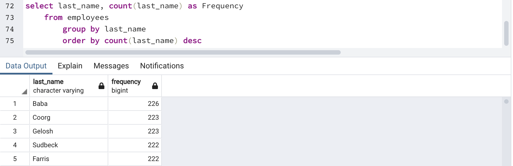

  

In this research project data modeling, engineering, and analyis were peformed on employees of a corporation from the 1980s and 1990s. All that remain of the database of employees from that period were six CSV files.
 

 

 
<h4>Data Modeling</h4>
The first step was to inspect the CSV's, design tables, and sketch them out in an ERD.  To facilitate this first step, Quick-DBD was used.

 
  

<h4>Data Engineering</h4>
Next, the information used to create the ERD was used to build a table schema for each of the six CSV files. In this step, data types, primary keys, foreign keys, and other constraints were identified.

 

 
  
  

 

 
<h4>Data Analysis</h4>
Finally, the CSV's were imported into a SQL database (PostgreSQL) where schema queries were run to answer questions about the data.  

 
 

<h3>Below are the individual schema queries that were run once the individual data sets were combined.</h3>

 

 
  <strong>List of details for each employee:</strong>
<ul>
  <li>Employee Number</li>
  <li>Last Name</li>
  <li>First Name</li>
  <li>Sex</li>
  <li>Salary</li>
</ul>

 
  
 

 
  <strong>Employees hired in 1986:</strong>
<ul>
  <li>First Name</li>
  <li>Last Name</li>
  <li>Hire Date</li>
</ul>

 
  

 
  <strong>The manager of each department with the following details:</strong>
<ul>
  <li>Department Number</li>
  <li>Department Name</li>
  <li>Manager's Employee Number</li>
  <li>Last Name</li>
  <li>First Name</li>
</ul>

 
  

 
  <strong>The department of each employee with the following details:</strong>
<ul>
  <li>Employee Number</li>
  <li>Last Name</li>
  <li>First Name</li>
  <li>Department Name</li>
</ul>

 
  

 
  <strong>Details for employees whose first name is "Hercules" and last names begin with "B":</strong>
<ul>
  <li>First Name</li>
  <li>Last Name</li>
  <li>Sex</li>
</ul>

 
  
 

 
  <strong>List of all employees in the Sales department, including the following details:</strong>
<ul>
  <li>Employee Number</li>
  <li>Last Name</li>
  <li>First Name</li>
  <li>Department Name</li>
</ul>

 
  

 
  <strong>List of all employees in the Sales and Development departments, including the following details:</strong>
<ul>
  <li>Employee Number</li>
  <li>Last Name</li>
  <li>First Name</li>
  <li>Department Name</li>
</ul>

 
  
  

 
  <strong>In descending order, a list of the frequency count of employee last names, i.e., how many employees share each last name</strong>

 
  
  

